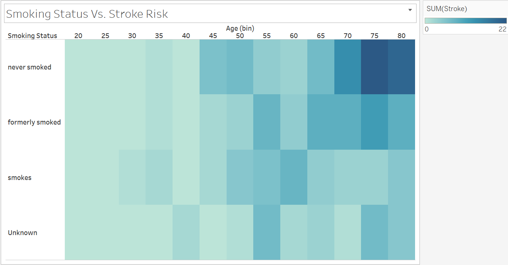
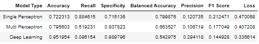

# Stroke Prediction

## Topic Selected
A stroke is a medical emergency when the brain is deprived of blood flow and subsequently oxygen and nutrients. According to the American Heart Association, strokes are the fifth leading cause of death and a major cause of disability in the United States. There are two different types of strokes; hemorrhagic strokes are when blood vessels burst in the brain and internal bleeding occurs and ischemic strokes are when blood vessels are blocked by a clot. A subcategory of ischemic strokes called transient ischemic events is when blood flow is only temporarily restricted to parts of the brain. They are considered “warning strokes” since the patient will likely go on to suffer from a major stroke if medical intervention is not received. Strokes can leave patients with permanent decreased motor function and cognitive abilities, severely affecting their quality of life.

The aim of this project is to build and compare different machine learning models that will assess eleven different clinical features including health and lifestyle metrics in order to predict if a patient is likely to suffer from a stroke.  Information is power and knowing the likelihood of suffering from a stroke, as well as what features play the most prominent role in risk assessment, can empower patients to take agency over their own health and wellbeing and take measures to reduce their risk. 


#### Questions to be Addressed: 
- Which learning model work best with our dataset?
- Which features influence the model the most?

## Dataset
The dataset was sourced from https://www.kaggle.com/datasets/fedesoriano/stroke-prediction-dataset. The dataset includes eleven different features regarding health and lifestyle. The goal is to determine if there is a way to determine a patient’s risk for stroke based on the eleven features.

### Assumptions and Limitations of the Dataset
- Age of the Patient: The assumption was made that the age in the dataset is referring to the age at which the patient suffered the stroke and not their age at data collection.
- Data Collection: The method of data collection was not released to the public. 


### Initial Analysis of the Data
Overview of the Features


Subjects in the Dataset Who Have Suffered A Stroke


Health Metrics


Heatmap of Smoking Status Brokendown by Age


Breakdown of Residence Type by Gender and Smoking Status


Average Glucose Level vs Age


Risk vs Marital Status, Job Type, and Age


Heatmap of Married and Residence Type Broken Down by Gender


### Results & Visualizations 

### Ensemble Learning

### Overview

For the ensemble section we decided to compare 2 models to understand which model would give the best results and for what reasons.

The models that were compared were:

- Balanced Random Forest Classifier

- Easy Ensemble AdaBoost Classifier

In preparation to compare the models there was an additional preprocessing step that was completed. We completed a one-hot encoding on the categorical data, as well as a standard scaler on the numerical data. The standard scaler changes would allow us to have a more consistently distributed dataset from which to train our model, and the one-hot encoding allows the model to understand the categorical values and utilize them in training.

### Ensemble Classifiers

Ensemble classifiers are methods that use multiple learning algorithms to obtain better predictive analysis.

#### Balanced Random Forest Classifier

*Balanced random forest classifier is a method that randomly undersamples each bootstrap sample to balance it*

```
Balanced Random Forest Classifier

Balanced Accuracy Score: 0.7757064364207221

                  Predicted No Stroke  Predicted Stroke
Actual No Stroke                  852               324
Actual Stroke                       9                43

                   pre       rec       spe        f1       geo       iba       sup

          0       0.99      0.72      0.83      0.84      0.77      0.59      1176
          1       0.12      0.83      0.72      0.21      0.77      0.61        52

avg / total       0.95      0.73      0.82      0.81      0.77      0.59      1228
```

For the results we see that overall precision is quite good, however the precision of predicted stoke is very low. This shows a high level of type 1 error [false positive].

#### Easy Ensemble AdaBoost Classifier

*Easy Ensemble AdaBoost Classifier is an ensemble of AdaBoost trained on different balanced bootstrap samples which are achieved by under-sampling*

```
Easy Ensemble AdaBoost Classifier

Balanced Accuracy Score: 0.7162480376766092

                  Predicted No Stroke  Predicted Stroke
Actual No Stroke                  780               396
Actual Stroke                      12                40

                   pre       rec       spe        f1       geo       iba       sup

          0       0.98      0.66      0.77      0.79      0.71      0.50      1176
          1       0.09      0.77      0.66      0.16      0.71      0.52        52

avg / total       0.95      0.67      0.76      0.77      0.71      0.51      1228
```

For the results we see that overall precision is quite good, however the precision of predicted stoke is very low. This shows a high level of type 1 error [false positive].

#### Ensemble Classifier Conclusions

Overall we see that the ensemble methods fare quite similarly in their results. They all seem very susceptible to type 1 error. Albeit in this scenario, type 1 error, or false positive is far more ideal than false negatives, which could lead to strokes that would not be predicted. The random forest classifier has far better recall however resulting in a higher f1 score. The stark difference of these two models can be traced to their inability to consistently discern when an actual stroke is occurring.

### Neural Networks 
### Overview
Neural Networks are machine learning strategies modeled after the human brain. Within neural networks, computations are performed by a neuron or a perceptron and have the ability to pass the data on to other neurons or other layers within the model. The benefit to this model is that after the initial layer, the subsequent perceptrons are working with weighted data instead of raw data.  
In these models, dense refers to the parameter that all perceptrons are interconnected and ReLU and Sigmoid are activation functions that weight the data in different ways. We were interested in a classification/binary decision and so only one output neuron with a sigmoid activation function was necessary to produce a probability output. During compiling the adam optimizer was used to help the model overcome weaker features and the binary_crossentropy loss function was chosen since it was specifically designed to evaluate a binary classification model.

#### Single Perceptron
*The simplest of the neural networks, it contains a single perceptron and only two layers. The input layer passes the data to the perceptron and the perceptron performs a set of calculations and passes the weighted data to an activation function for the output layer.*

#### Multi Perceptron, Single Layer
*In this step the model is elevated to an Artificial Neural Network (ANN) with the addition of other perceptrons.*

#### Deep Learning
*A network of multiple layers named hidden layers, holding multiple perceptions. There are different types of interconnectedness including Convolution Neural Networks (CNN), Recurrent Neural Networks (RNN), and Long Short-Term Memory Networks (LSTM). Here the relatively simple dense, feed-forward network was used.*

### Neural Network Results




### Neural Network Conclusion
Here we can see that as the neural network becomes more complex, it becomes more susceptible to overfitting; both the precision and the balanced accuracy scored drop significantly. The simplest, single perceptron model yields the best results. 

## Feature Importance

We wanted to take a look at the specific inputs that the model was using to make its classifying decision. These were the percentage weight it was putting on each of the inputted features. 


<style>
.tablelines table, .tablelines td, .tablelines th {
        border: 1px solid black;
        }
</style>

<table class="tablelines">
  <thead>
    <tr>
      <th>Feature</th>
      <th>Weighted Percentage</th>
     </tr>
  </thead>
  <tbody>
    <tr>
      <td>Age</td>
      <td>0.33983</td>
     </tr>
    <tr>
      <td>Avg Glucose Level</td>
      <td>0.17349</td>
    </tr>
    <tr>
      <td>BMI</td>
      <td>0.14972</td>
    </tr>
    <tr>
      <td>Hypertension</td>
      <td>0.042611</td>
    </tr>
    <tr>
      <td>Work Type: Self-employed</td>
      <td>0.026672</td>
    </tr>
    <tr>
      <td>Heart Disease</td>
      <td>0.026672</td>
    </tr>
    <tr>
      <td>Ever Married: No</td>
      <td>0.024329</td>
    </tr>   
    <tr>
      <td>Ever Married: Yes</td>
      <td> 0.023116</td>
    </tr>
    <tr>
      <td>Smoking Status: Unknown</td>
      <td>0.020450</td>
    </tr>
    <tr>
      <td>Work Type: Private</td>
      <td>0.020072</td>
    </tr>
    <tr>
      <td>Smoking Status: Never Smoked </td>
      <td>0.019952</td>
    </tr>
    <tr>
      <td>Smoking Status: Formerly Smoked</td>
      <td>0.019684</td>
    </tr> 
    <tr>
      <td>Work Type: Children</td>
      <td>0.018427</td>
    </tr>
    <tr>
      <td>Residence Type: Urban</td>
      <td>0.017786</td>
    </tr>
    <tr>
      <td>Gender: Male</td>
      <td>0.016488</td>
    </tr>
    <tr>
      <td>Residence Type: Rural</td>
      <td>0.016397</td>
    </tr>
    <tr>
      <td>Smoking Status: Smokes</td>
      <td>0.015680</td>
    </tr>      
    <tr>
      <td>Gender: Female</td>
      <td>0.014850</td>
    </tr>
    <tr>
      <td>Work Type: Goverment Job</td>
      <td>0.013635</td>
    </tr>
    <tr>
      <td>Work Type: Never Worked</td>
      <td>0.00014072</td>
    </tr>
    <tr>
      <td>Gender: Other</td>
      <td>0.0</td>
    </tr>
  </tbody>
</table>

## Project Conclusion
In comparing the machine learning models we found that the sampling models were tending to fare best. With f1 scores in the low .8's the sampling models were able to present high precision paired with average recall in their attempts to correctly identify a stroke given the inputs. It's important to note that our relatively small dataset required samples to be oversampled to make up for the minority class. This was leading to the neural networks overfitting to the sample reducing its overall accuracy. Given this were were OK with the general trend of type 1 error as it is more ideal to respond in a false positive. This is similar to the trends we saw in the less complex neural networks, as well as the ensemble classifiers.

We also wanted to find the features that most influenced the models. 3 features particularly stood out: Age, Average Glucose Level, and BMI. Age was the highest weighting as the older the age, the more likely one is to have a stoke. But the pairing with the age with other health metrics was also very telling as the likelihood of there being other health issues would also increase the chance of a stoke. This is why the next 2 features are very interesting to look at. With a high BMI we saw that age played a lesser effect in the stroke likelihood. In regards to glucose level, we saw that the bulk of our samples were in the normal range, but as age increased the average glucose level also increased.
